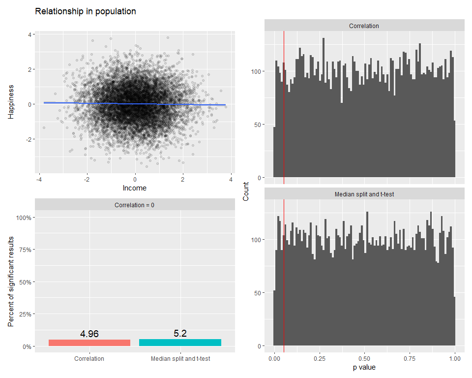
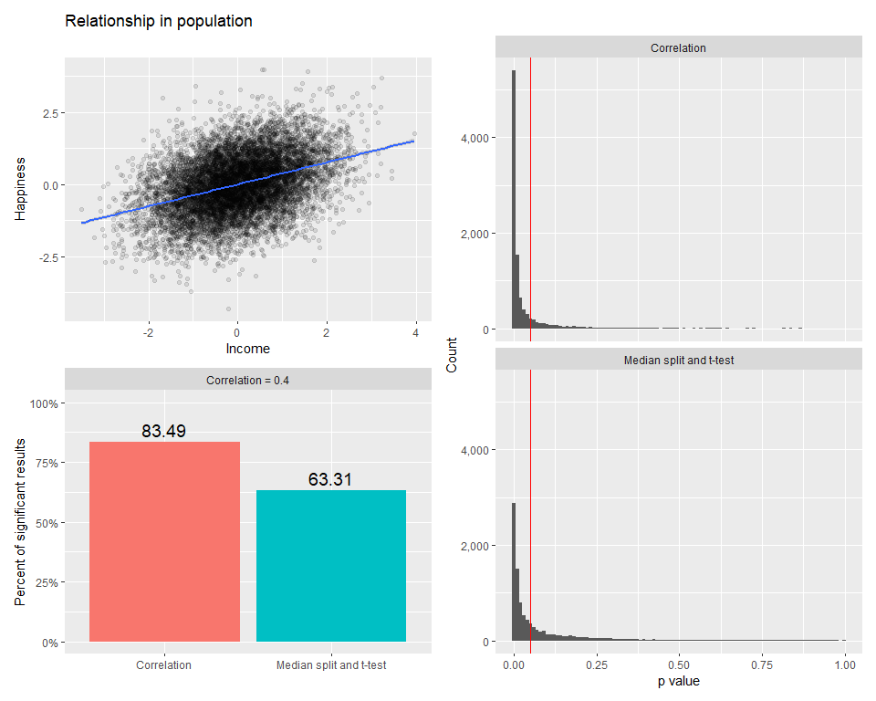
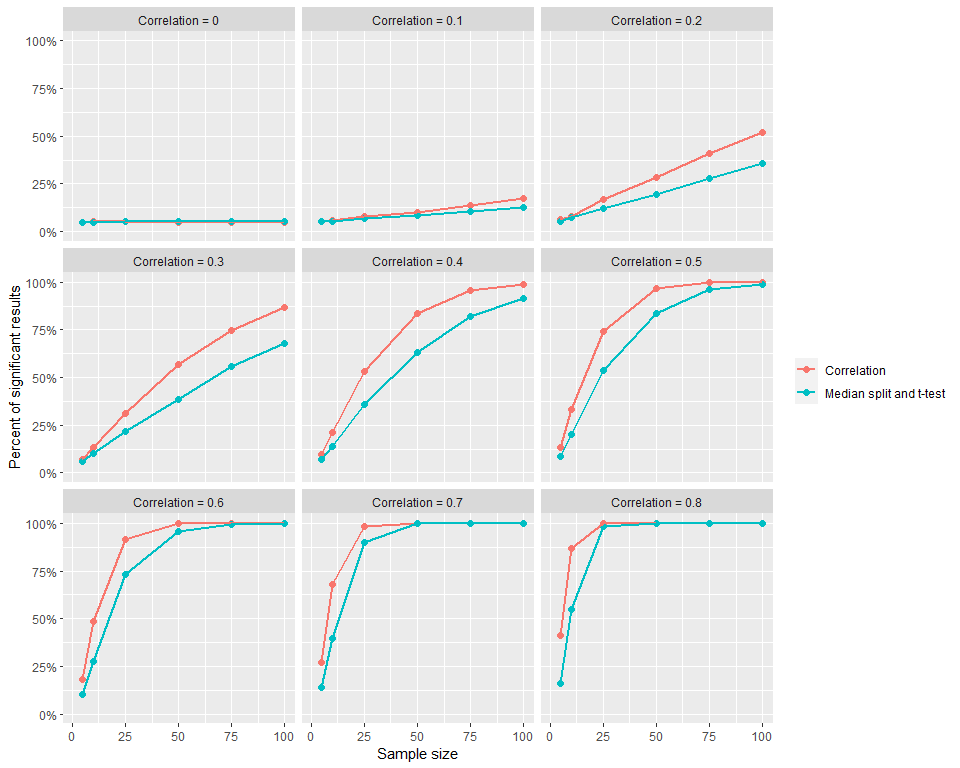
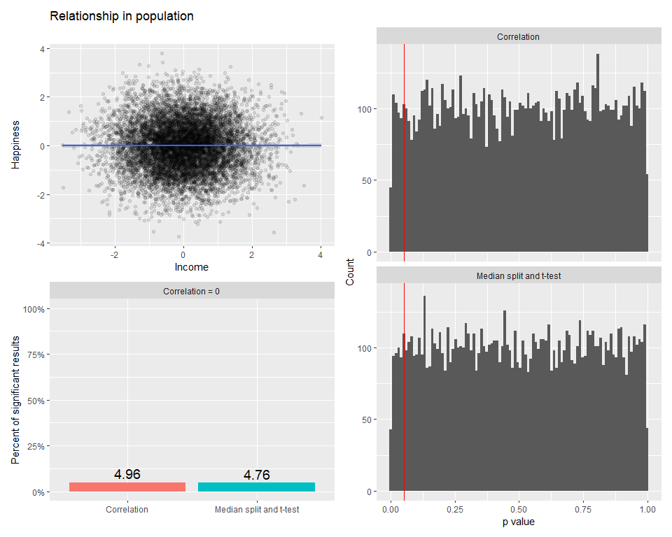
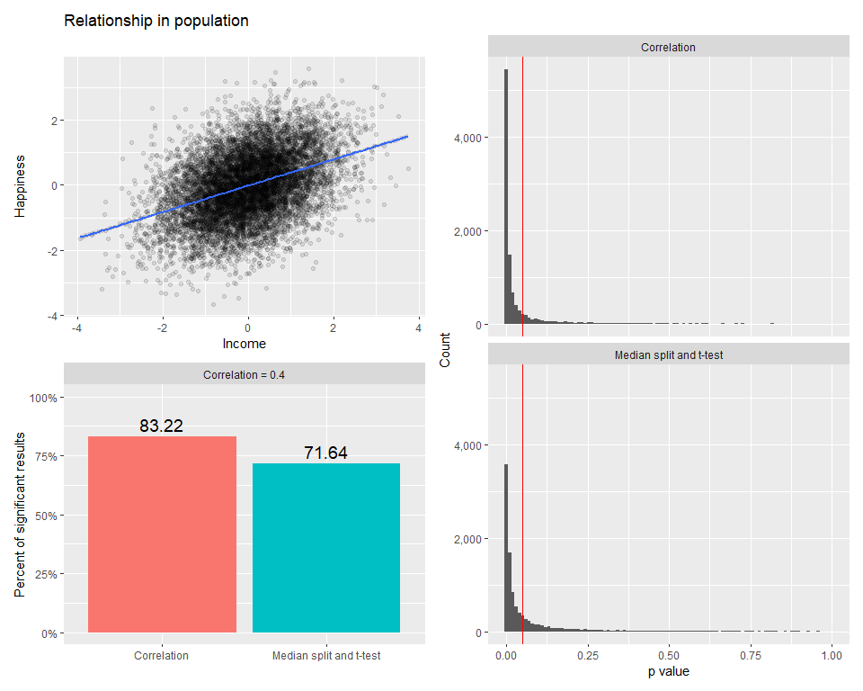
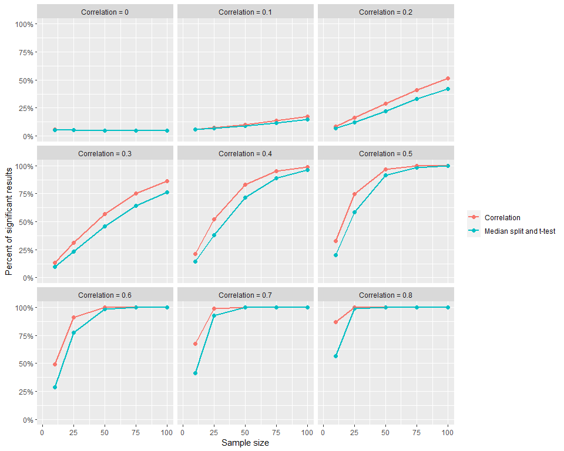

### Correlation and t-test with median split monte carlo simulations

Given two continuous variables x and y, researchers can run a
correlation between the two variables. Alternatively, researchers might
choose to perform a median split on the x variable creating a “low” and
“high” group and then conduct a t-test with the newly binarized x
variable and the original continuous y variable. I will conduct a series
of monte carlo simulations to determine the effect on type 1 errors
(false positives) and type 2 errors (false negatives) on these two
analysis methods.

``` r
library(tidyverse)
```

<br />

### Functions to generate data and run simulations

``` r
### generate data with x and y variables from distribution with specific correlation
cor_data <- function(n, r) {
    x <- rnorm(n)
    
    C <- matrix(r, nrow = 2, ncol = 2)
    diag(C) <- 1
    
    C <- chol(C)
    
    y <- rnorm(n)
    df <- cbind(x, y)
    
    df <- df %*% C
    
    return(df)
}

### generate one simulation iteration
simulate <- function(n, r, p){
    df <- cor_data(n, r)
    x <- df[ , 1]
    y <- df[ , 2]
    
    x_ms <- ifelse(x < quantile(x, probs = p), 0, ifelse(x > quantile(x, probs = 1 - p), 1, NA))
    
    return(c(cor_p = cor.test(x, y)$p.value,
             t_p = t.test(y ~ x_ms, var.equal = TRUE)$p.value))
}

### run monte carlo simulation with n iterations
monte_carlo_simulation <- function(n, r, p, n_sims = 10000){
    replicate(n_sims, simulate(n, r, p)) %>%
        t() %>%
        as_tibble() %>%
        mutate(sample_size = n) %>%
        mutate(correlation = r)
}
```

<br />

### Run simulation for correlation and t-test with median split simulation

Here I generate an x and y variable from a known distribution, conduct a
correlation, conduct a median split and t-test, then record the p values
of each of these tests. I then replicate this procedure many times.

When there is no relationship between x and y in the population, ideally
a statistical test should not yield a significant p value (i.e., p \<
0.05). Similarly, where there is a known relationship between x and y,
ideally a statistical test should yield a significant p value (i.e., p
\< 0.05). In other words, we want our statistical tests to be sensitive
enough to detect effects but not so sensitive they detect effects that
do not exist.

``` r
set.seed(1234567)
params <- expand.grid(sample_sizes = c(5, 10, 25, 50, 75, 100),
                      cors = seq(0, 0.8, 0.1))

results <- map2_df(params$sample_sizes, params$cors, monte_carlo_simulation, p = 0.5)
```

<br />

### Plot simulation for correlation and t-test with median split simulation

``` r
### plot population correlation data
plot_cor_data <- function(n, r, alpha = 0.1){
    cor_data(n, r) %>% 
        as_tibble() %>% 
        rename(x = V1,
               y = V2) %>%
        ggplot(aes(x, y)) + 
        geom_point(alpha=alpha) + 
        geom_smooth(method = "lm") +
        labs(x = "Income",
             y = "Happiness",
             title = "Relationship in population")
}

### plot histogram of distribution of p values from both correltion and 
### median split with t-test
plot_p_hist <- function(tbl, n, r){
    tbl %>%
        filter(correlation == r) %>%
        filter(sample_size == n) %>%
        gather(test, error_rate, -sample_size, -correlation) %>%
        mutate(test = fct_recode(test, 
                              "Correlation" = "cor_p",
                              "Median split and t-test" = "t_p")) %>%
        ggplot(aes(error_rate)) +
        geom_histogram(bins = 100) +
        facet_wrap(~test, ncol = 1) +
        geom_vline(xintercept = 0.05, color = "red") +
        labs(x = "p value",
             y = "Count") +
        scale_y_continuous(label = scales::comma_format())
}

### plot percent of null hypothesis rejections from both correltion and 
### median split with t-test
plot_results_bar <- function(tbl, n, r){
    tbl %>%
        filter(correlation %in% r) %>%
        filter(sample_size == n) %>%
        group_by(sample_size, correlation) %>%
        summarize(cor_error = mean(cor_p < 0.05),
                  t_error = mean(t_p < 0.05)) %>%
        ungroup() %>%
        gather(test, error_rate, -sample_size, -correlation) %>%
        mutate(test = fct_recode(test, 
                                  "Correlation" = "cor_error",
                                  "Median split and t-test" = "t_error")) %>%
        mutate(correlation = paste0("Correlation = ", correlation)) %>%
        ggplot(aes(test, error_rate, fill = test)) +
        geom_col(position = "dodge") +
        facet_wrap(~correlation) +
        labs(x = NULL,
             y = "Percent of significant results",
             fill = NULL) +
        theme(legend.position = "none") +
        scale_y_continuous(label = scales::percent_format()) +
        expand_limits(y = c(0, 1)) +
        geom_text(aes(label = round(error_rate * 100, 2)), nudge_y = .05, size = 5)
}

### plot proportion of null hypothesis rejections across a range of populaton 
### correlation values from both correltion and median split with t-test
plot_results_line <- function(tbl, r, legend_position){
    tbl %>%
        filter(correlation %in% r) %>%
        group_by(sample_size, correlation) %>%
        summarize(cor_error = mean(cor_p < 0.05),
                  t_error = mean(t_p < 0.05)) %>%
        ungroup() %>%
        gather(test, error_rate, -sample_size, -correlation) %>%
        mutate(test = fct_recode(test, 
                                  "Correlation" = "cor_error",
                                  "Median split and t-test" = "t_error")) %>%
        mutate(correlation = paste0("Correlation = ", correlation)) %>%
        ggplot(aes(sample_size, error_rate, color = test, group = test)) +
        geom_point(size = 2) +
        geom_line(size = 1) +
        expand_limits(y = c(0, 1)) +
        expand_limits(x = c(1, 100)) +
        facet_wrap(~correlation) +
        labs(x = "Sample size",
             y = "Percent of significant results",
             color = NULL) +
        theme(legend.position = legend_position) +
        scale_y_continuous(label = scales::percent_format())
}
```

<br />

### Plot results from correlation and t-test with median split simulation

``` r
library(patchwork)

p1 <- plot_cor_data(n = 10000, r = 0)
p2 <- plot_results_bar(results, n = 50, r = 0)
p3 <- plot_p_hist(results, n = 50, r = 0)
(p1 / p2) | p3
```



``` r
p4 <- plot_cor_data(n = 10000, r = 0.4)
p5 <- plot_results_bar(results, n = 50, r = 0.4)
p6 <- plot_p_hist(results, n = 50, r = 0.4)
(p4 / p5) | p6
```



``` r
plot_results_line(results, seq(0, 0.8, 0.1), "right")
```



The results of these simulations show that the correlation and t-test
both have a type 1 error rate of about 5%. However, the type 2 error
rates of the t-test are much higher than the correlation. In other
words, the t-test with median split is much less powerful (in a
statistical sense) then the correlation.

<br />

### Run simulation for correlation and t-test with top and bottom 33% split simulation

Rather than performing a median split then t-test, a researcher might
select the top and bottom n percent of highest and lowest x values to
create to groups, discarding the center of the x variable.

The simulation below selects the highest 33% of x values creating a
“high” group and the bottom 33% of x values creating a “low” group, then
conducts a t-test with those two groups and the corresponding y values
(the center 33% of data is discarded).

``` r
set.seed(1234567)
params <- expand.grid(sample_sizes = c(10, 25, 50, 75, 100),
                      cors = seq(0, 0.8, 0.1))

results <- map2_df(params$sample_sizes, params$cors, monte_carlo_simulation, p = 0.33)
```

<br />

### Plot results from correlation and t-test with top and bottom 25% split simulation

``` r
p1 <- plot_cor_data(n = 10000, r = 0)
p2 <- plot_results_bar(results, n = 50, r = 0)
p3 <- plot_p_hist(results, n = 50, r = 0)
(p1 / p2) | p3
```



``` r
p4 <- plot_cor_data(n = 10000, r = 0.4)
p5 <- plot_results_bar(results, n = 50, r = 0.4)
p6 <- plot_p_hist(results, n = 50, r = 0.4)
(p4 / p5) | p6
```



``` r
plot_results_line(results, seq(0, 0.8, 0.1), "right")
```



As with the previous set of simulations, the results of these
simulations show that the correlation and t-test both have a type 1
error rate of about 5%. However, the type 2 error rates of the t-test
are much higher than the correlation. In other words, the t-test with
median split is much less powerful (in a statistical sense) then the
correlation.

To try different number of simulations, population correlation, sample
size, and split method, use the shiny app found in the /shiny_app
directory.

<br /> <br /> <br /> <br /> <br />
